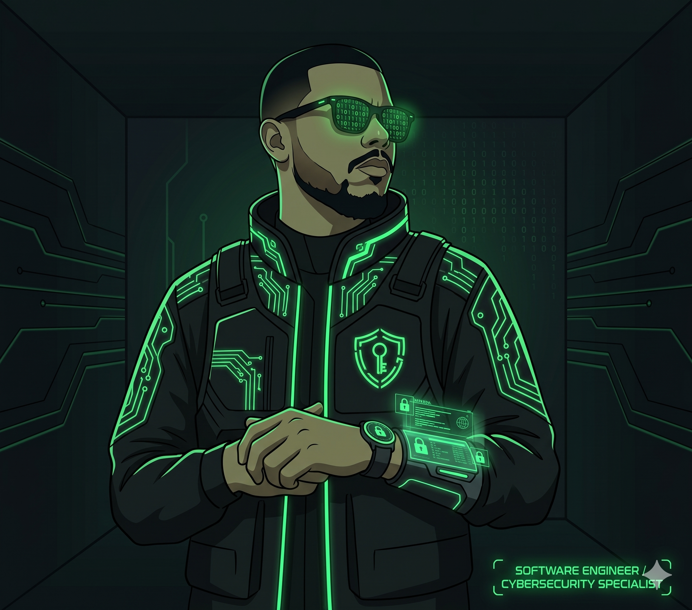

<!--
  Daniel Alisom - GitHub Profile README
  Theme: Cyber Hunter / Hacker Aesthetic (Matrix Green)
  Inspired by: BotGJ16
-->

  

  

  

  
  
  

---

### ⚡ [[ SYSTEM STATUS: ONLINE ]]

> **Full-stack developer specializing in Go and AI-driven architectures.** I build high-performance systems and break them to make them stronger. Currently pursuing a degree in **Artificial Intelligence** and active in the **Bug Bounty** scene.

---

### 🛡️ OFFENSIVE CAPABILITIES & ARCHITECTURE

<table align="center">
  <tr>
    <td width="33%" valign="top">
      <h4 align="center">🔴 OFFENSIVE SECURITY</h4>
      <ul>
        <li><b>Bug Bounty:</b> Active on HackerOne.</li>
        <li><b>Web Exploitation:</b> SQLi, XSS, SSRF, IDOR.</li>
        <li><b>Recon/OSINT:</b> Advanced subdomain enumeration & fingerprinting.</li>
        <li><b>Red Teaming:</b> Pentesting & CTF enthusiast.</li>
      </ul>
    </td>
    <td width="33%" valign="top">
      <h4 align="center">⚙️ SOFTWARE ENGINEERING</h4>
      <ul>
        <li><b>Backend:</b> High-concurrency Go (Gin/Fiber).</li>
        <li><b>Mobile:</b> Kotlin (Android) & Flutter/Dart.</li>
        <li><b>Infrastructure:</b> AWS (ECS/Fargate), Terraform, Docker.</li>
        <li><b>Scalability:</b> Systems handling 20+ docs/sec.</li>
      </ul>
    </td>
    <td width="33%" valign="top">
      <h4 align="center">🤖 ARTIFICIAL INTELLIGENCE</h4>
      <ul>
        <li><b>LLM Integration:</b> OpenAI, Claude, Hugging Face.</li>
        <li><b>OCR Pipelines:</b> AWS Textract, Tesseract.</li>
        <li><b>Agents:</b> TUI-based AI assistants (Rust/Ratatui).</li>
        <li><b>Optimization:</b> Multilingual summarization & NLP.</li>
      </ul>
    </td>
  </tr>
</table>

---

### 🛠️ THE ARSENAL (WEAPONRY)

<b>💻 Programming & Scripting</b>

  
  
  
  
  
  
  
  

<b>📡 Offensive Security Tools</b>

  
  
  
  
  
  

<b>☁️ Cloud & Infrastructure</b>

  
  
  
  
  
  

---

### 📂 CLASSIFIED PROJECTS (FEATURED)

  
  

---

### 📊 THREAT METRICS

  
   
  

  
  

  <b>Threat Level:</b> 

---

  

